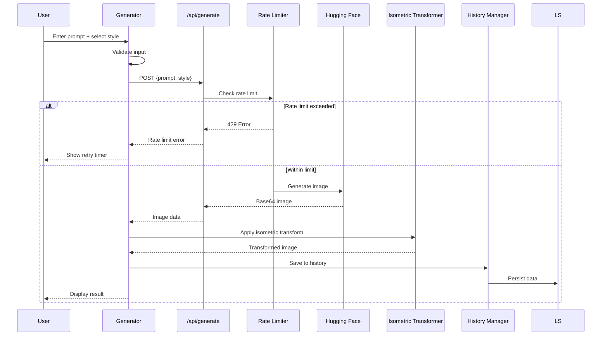

# Design Document: AI Isometric Icon Generator

## Overview

AI Isometric Icon Generator adalah aplikasi Next.js yang memungkinkan pengguna membuat ikon isometrik bergaya 3D melalui text prompt. Aplikasi ini menggunakan Hugging Face Inference API untuk generasi gambar dan menerapkan post-processing canvas untuk efek isometrik.

Arsitektur mengikuti pola Server Components untuk performa optimal, dengan client-side interactivity hanya di komponen yang membutuhkan state. API routes digunakan untuk menyembunyikan API key dan menangani rate limiting.

## Architecture

```mermaid
graph TB
    subgraph "Client Layer"
        LP[Landing Page<br/>Server Component]
        GP[Generator Page<br/>Client Component]
        HP[History Panel<br/>Client Component]
    end

    subgraph "API Layer"
        AR[/api/generate<br/>Route Handler]
        RL[Rate Limiter<br/>Middleware]
    end

    subgraph "Services"
        HF[Hugging Face<br/>Inference API]
        IT[Isometric<br/>Transformer]
        HM[History<br/>Manager]
    end

    subgraph "Storage"
        LS[(localStorage)]
        ENV[(Environment<br/>Variables)]
    end

    LP --> GP
    GP --> AR
    GP --> IT
    GP --> HM
    HP --> HM
    AR --> RL
    RL --> HF
    HM --> LS
    AR --> ENV
```

### Data Flow



## Components and Interfaces

### Page Components

#### LandingPage (Server Component)

```typescript
// app/page.tsx
interface LandingPageProps {}

// Renders:
// - HeroSection with value proposition
// - IconGallery with example icons
// - CTAButton linking to /generate
// - SEO metadata via generateMetadata()
```

#### GeneratorPage (Client Component)

```typescript
// app/generate/page.tsx
'use client';

interface GeneratorPageProps {}

interface GeneratorState {
  prompt: string;
  style: StylePreset;
  isGenerating: boolean;
  generatedImage: string | null;
  error: GenerationError | null;
  progress: number;
}
```

### UI Components

#### PromptInput

```typescript
interface PromptInputProps {
  value: string;
  onChange: (value: string) => void;
  maxLength: number;
  disabled?: boolean;
  error?: string;
}
```

#### StyleSelector

```typescript
type StylePreset = 'default' | 'warm' | 'monochrome' | 'pastel';

interface StyleSelectorProps {
  value: StylePreset;
  onChange: (style: StylePreset) => void;
  disabled?: boolean;
}

const STYLE_CONFIGS: Record<StylePreset, StyleConfig> = {
  default: {
    name: 'Default',
    colors: ['#6366f1', '#3b82f6'],
    promptSuffix: 'blue tones',
  },
  warm: {
    name: 'Warm',
    colors: ['#f97316', '#ef4444'],
    promptSuffix: 'warm orange and red tones',
  },
  monochrome: {
    name: 'Monochrome',
    colors: ['#6b7280', '#374151'],
    promptSuffix: 'grayscale monochrome',
  },
  pastel: {
    name: 'Pastel',
    colors: ['#f9a8d4', '#a5b4fc'],
    promptSuffix: 'soft pastel colors',
  },
};
```

#### GenerateButton

```typescript
interface GenerateButtonProps {
  onClick: () => void;
  isLoading: boolean;
  disabled?: boolean;
  progress?: number;
}
```

#### ImageDisplay

```typescript
interface ImageDisplayProps {
  src: string | null;
  alt: string;
  isLoading: boolean;
  onDownload: () => void;
  onRegenerate: () => void;
}
```

#### HistoryPanel

```typescript
interface HistoryPanelProps {
  items: HistoryItem[];
  onSelect: (item: HistoryItem) => void;
  onRedownload: (item: HistoryItem) => void;
  onClear: () => void;
}
```

#### ErrorDisplay

```typescript
interface ErrorDisplayProps {
  error: GenerationError;
  onRetry: () => void;
}
```

### Service Interfaces

#### API Route Handler

```typescript
// app/api/generate/route.ts
interface GenerateRequest {
  prompt: string;
  style: StylePreset;
}

interface GenerateResponse {
  success: boolean;
  image?: string; // Base64 encoded
  error?: {
    code:
      | 'RATE_LIMIT'
      | 'SERVICE_UNAVAILABLE'
      | 'UNAUTHORIZED'
      | 'SERVER_ERROR'
      | 'VALIDATION_ERROR';
    message: string;
    retryAfter?: number;
  };
}
```

#### Isometric Transformer

```typescript
// lib/isometric-transformer.ts
interface TransformOptions {
  rotationAngle: number; // Default: 30
  depthGradient: boolean;
  shadowEnabled: boolean;
  shadowOffset: {x: number; y: number};
}

function transformToIsometric(
  imageData: string,
  options?: Partial<TransformOptions>,
): Promise<string>;
```

#### History Manager

```typescript
// lib/history-manager.ts
interface HistoryItem {
  id: string;
  prompt: string;
  style: StylePreset;
  imageData: string;
  createdAt: number;
}

interface HistoryManager {
  getAll(): HistoryItem[];
  add(item: Omit<HistoryItem, 'id' | 'createdAt'>): HistoryItem;
  remove(id: string): void;
  clear(): void;
}
```

#### Rate Limiter

```typescript
// lib/rate-limiter.ts
interface RateLimitState {
  count: number;
  resetTime: number;
}

interface RateLimiter {
  canMakeRequest(): boolean;
  recordRequest(): void;
  getTimeUntilReset(): number;
  getRemainingRequests(): number;
}
```

### Hooks

#### useGenerator

```typescript
// hooks/use-generator.ts
interface UseGeneratorReturn {
  state: GeneratorState;
  generate: (prompt: string, style: StylePreset) => Promise<void>;
  regenerate: () => Promise<void>;
  download: () => void;
  reset: () => void;
}
```

#### useHistory

```typescript
// hooks/use-history.ts
interface UseHistoryReturn {
  items: HistoryItem[];
  addItem: (item: Omit<HistoryItem, 'id' | 'createdAt'>) => void;
  removeItem: (id: string) => void;
  clearHistory: () => void;
}
```

#### useRateLimit

```typescript
// hooks/use-rate-limit.ts
interface UseRateLimitReturn {
  canRequest: boolean;
  remainingRequests: number;
  timeUntilReset: number;
  recordRequest: () => void;
}
```

## Data Models

### Core Types

```typescript
// types/index.ts

type StylePreset = 'default' | 'warm' | 'monochrome' | 'pastel';

interface StyleConfig {
  name: string;
  colors: [string, string];
  promptSuffix: string;
}

interface GenerationError {
  code:
    | 'RATE_LIMIT'
    | 'SERVICE_UNAVAILABLE'
    | 'UNAUTHORIZED'
    | 'SERVER_ERROR'
    | 'VALIDATION_ERROR';
  message: string;
  retryAfter?: number;
}

interface HistoryItem {
  id: string;
  prompt: string;
  style: StylePreset;
  imageData: string; // Base64 PNG
  createdAt: number; // Unix timestamp
}

interface GeneratorState {
  prompt: string;
  style: StylePreset;
  isGenerating: boolean;
  generatedImage: string | null;
  error: GenerationError | null;
  progress: number; // 0-100
}
```

### localStorage Schema

```typescript
// Key: 'isometric-generator-history'
interface StoredHistory {
  version: 1;
  items: HistoryItem[];
}

// Key: 'isometric-generator-rate-limit'
interface StoredRateLimit {
  count: number;
  windowStart: number; // Unix timestamp
}
```

### API Schemas

```typescript
// Hugging Face API Request
interface HuggingFaceRequest {
  inputs: string;
  parameters?: {
    negative_prompt?: string;
    num_inference_steps?: number;
    guidance_scale?: number;
  };
}

// Hugging Face API Response
type HuggingFaceResponse = Blob; // Image blob
```

## Correctness Properties

_A property is a characteristic or behavior that should hold true across all valid executions of a system—essentially, a formal statement about what the system should do. Properties serve as the bridge between human-readable specifications and machine-verifiable correctness guarantees._

### Property 1: Character Limit Enforcement

_For any_ input string of length N, the PromptInput component SHALL either truncate the string to 200 characters or prevent input beyond 200 characters, AND the character counter SHALL display (200 - min(N, 200)) as remaining characters.

**Validates: Requirements 2.2, 2.3**

### Property 2: Empty Input Rejection

_For any_ string composed entirely of whitespace characters (including empty string), the Generator SHALL reject the input and prevent form submission, returning a validation error.

**Validates: Requirements 2.4**

### Property 3: XSS Input Sanitization

_For any_ input string containing potential XSS vectors (script tags, event handlers, javascript: URLs), the sanitize function SHALL return a string with all dangerous content escaped or removed, such that the output cannot execute arbitrary code when rendered.

**Validates: Requirements 2.5**

### Property 4: Style Preset to Prompt Mapping

_For any_ StylePreset value, when applied to a generation request, the resulting prompt sent to the API SHALL contain the corresponding style suffix from STYLE_CONFIGS, ensuring consistent style application.

**Validates: Requirements 3.4**

### Property 5: Regenerate State Preservation

_For any_ successful generation with prompt P and style S, when regenerate is called, the new generation request SHALL use the same prompt P and style S, producing a request with identical parameters.

**Validates: Requirements 4.7**

### Property 6: Isometric Transformation Matrix

_For any_ input image, the Isometric_Transformer SHALL apply a transformation matrix that rotates the image by 30° around the isometric axis, such that the output image dimensions and rotation angle are mathematically consistent with isometric projection.

**Validates: Requirements 5.1**

### Property 7: Filename Generation from Prompt

_For any_ prompt string, the generated filename SHALL be derived from the prompt by: converting to lowercase, replacing spaces with hyphens, removing special characters, and appending ".png", such that the filename is valid for all operating systems.

**Validates: Requirements 6.3**

### Property 8: Error Retry Availability

_For any_ GenerationError returned from the API, the Generator SHALL display a retry button that, when clicked, re-attempts the generation with the same parameters.

**Validates: Requirements 7.5**

### Property 9: Rate Limit Enforcement

_For any_ sequence of N generation requests within a 60-second window, the Rate_Limiter SHALL allow the first 10 requests and block all subsequent requests until the window resets, returning a RATE_LIMIT error for blocked requests.

**Validates: Requirements 8.1, 8.2**

### Property 10: History Persistence Round-Trip

_For any_ HistoryItem saved to localStorage, retrieving the history after a simulated session reset SHALL return an array containing that item with identical id, prompt, style, imageData, and createdAt values.

**Validates: Requirements 9.1, 9.6**

### Property 11: API Input Sanitization

_For any_ user input sent to the API route, the input SHALL be validated and sanitized before being forwarded to the Hugging Face API, ensuring no malicious content reaches the external service.

**Validates: Requirements 13.4**

## Error Handling

### Error Types and Responses

| Error Code          | HTTP Status | User Message                                                | Action                |
| ------------------- | ----------- | ----------------------------------------------------------- | --------------------- |
| RATE_LIMIT          | 429         | "Too many requests. Please try again in {X} seconds."       | Show countdown timer  |
| SERVICE_UNAVAILABLE | 503         | "Service is currently unavailable. Please try again later." | Show retry button     |
| UNAUTHORIZED        | 401         | "Authentication error occurred. Please refresh the page."   | Show refresh button   |
| SERVER_ERROR        | 500         | "A server error occurred. Please try again."                | Show retry button     |
| VALIDATION_ERROR    | 400         | "Invalid input. Please check your prompt."                  | Highlight input field |
| TIMEOUT             | 408         | "Request timed out. Please try again."                      | Show retry button     |

### Error Handling Flow

```typescript
// Error handling in useGenerator hook
async function handleGeneration(prompt: string, style: StylePreset) {
  try {
    // Validate input
    if (!isValidPrompt(prompt)) {
      throw new ValidationError('Invalid prompt');
    }

    // Check rate limit
    if (!rateLimiter.canMakeRequest()) {
      throw new RateLimitError(rateLimiter.getTimeUntilReset());
    }

    // Make API request with timeout
    const response = await fetchWithTimeout('/api/generate', {
      method: 'POST',
      body: JSON.stringify({prompt, style}),
      timeout: 30000,
    });

    if (!response.ok) {
      throw new APIError(response.status, await response.json());
    }

    return await response.json();
  } catch (error) {
    // Transform to GenerationError
    return {error: mapToGenerationError(error)};
  }
}
```

### Accessibility for Errors

- All error messages use `aria-live="polite"` region
- Error messages are associated with form fields via `aria-describedby`
- Focus moves to error message or retry button on error
- Error icons have `aria-hidden="true"` with text alternatives

## Testing Strategy

### Dual Testing Approach

Testing menggunakan kombinasi unit tests dan property-based tests untuk coverage yang komprehensif:

- **Unit tests**: Memverifikasi contoh spesifik, edge cases, dan kondisi error
- **Property tests**: Memverifikasi properti universal di semua input yang valid

### Testing Framework

- **Unit Testing**: Vitest + React Testing Library
- **Property-Based Testing**: fast-check
- **E2E Testing**: Playwright (optional)

### Property-Based Test Configuration

```typescript
// vitest.config.ts
export default defineConfig({
  test: {
    // Property tests run minimum 100 iterations
    fuzz: {
      iterations: 100,
    },
  },
});
```

### Test Organization

```
__tests__/
├── unit/
│   ├── components/
│   │   ├── PromptInput.test.tsx
│   │   ├── StyleSelector.test.tsx
│   │   ├── GenerateButton.test.tsx
│   │   └── HistoryPanel.test.tsx
│   ├── hooks/
│   │   ├── useGenerator.test.ts
│   │   ├── useHistory.test.ts
│   │   └── useRateLimit.test.ts
│   └── lib/
│       ├── isometric-transformer.test.ts
│       ├── rate-limiter.test.ts
│       └── sanitizer.test.ts
├── properties/
│   ├── character-limit.property.test.ts
│   ├── input-validation.property.test.ts
│   ├── style-mapping.property.test.ts
│   ├── isometric-transform.property.test.ts
│   ├── filename-generation.property.test.ts
│   ├── rate-limiter.property.test.ts
│   └── history-persistence.property.test.ts
└── integration/
    └── generator-flow.test.ts
```

### Property Test Examples

```typescript
// Feature: ai-isometric-icon-generator, Property 1: Character Limit Enforcement
import {fc} from 'fast-check';
import {enforceCharacterLimit, calculateRemaining} from '@/lib/input-utils';

describe('Property 1: Character Limit Enforcement', () => {
  it('should enforce 200 character limit for all inputs', () => {
    fc.assert(
      fc.property(fc.string(), (input) => {
        const result = enforceCharacterLimit(input, 200);
        const remaining = calculateRemaining(result, 200);

        expect(result.length).toBeLessThanOrEqual(200);
        expect(remaining).toBe(200 - result.length);
      }),
      {numRuns: 100},
    );
  });
});

// Feature: ai-isometric-icon-generator, Property 9: Rate Limit Enforcement
describe('Property 9: Rate Limit Enforcement', () => {
  it('should allow first 10 requests and block subsequent ones', () => {
    fc.assert(
      fc.property(fc.integer({min: 1, max: 20}), (requestCount) => {
        const limiter = createRateLimiter();
        const results: boolean[] = [];

        for (let i = 0; i < requestCount; i++) {
          results.push(limiter.canMakeRequest());
          if (results[results.length - 1]) {
            limiter.recordRequest();
          }
        }

        const allowedCount = results.filter(Boolean).length;
        expect(allowedCount).toBeLessThanOrEqual(10);

        if (requestCount > 10) {
          expect(results.slice(10).every((r) => !r)).toBe(true);
        }
      }),
      {numRuns: 100},
    );
  });
});
```

### Unit Test Coverage Requirements

- Components: Render tests, interaction tests, accessibility tests
- Hooks: State management, side effects, error handling
- Utilities: Edge cases, error conditions, boundary values
- API Routes: Request validation, error responses, success responses

### Test Tagging Convention

Setiap property test HARUS memiliki comment yang mereferensikan design property:

```typescript
/**
 * Feature: ai-isometric-icon-generator
 * Property 1: Character Limit Enforcement
 * Validates: Requirements 2.2, 2.3
 */
```
