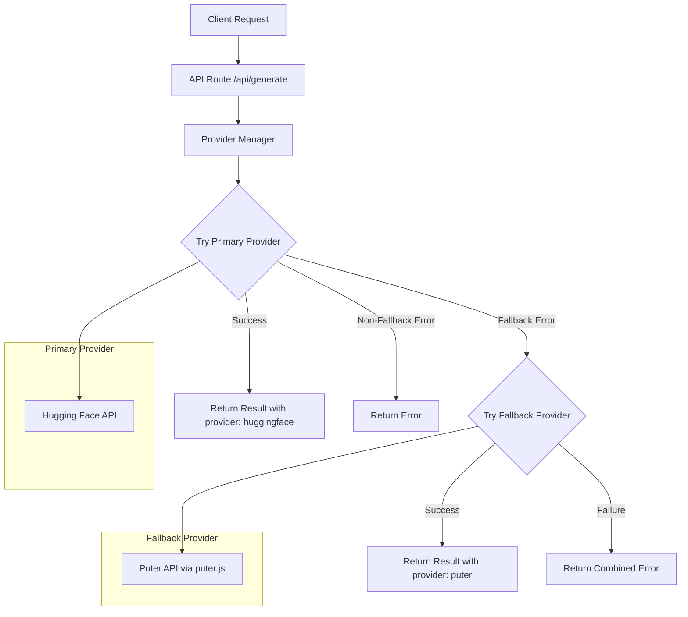

# Design Document: API Fallback Provider

## Overview

This design implements a fallback mechanism for the image generation API that automatically switches from Hugging Face (primary) to Puter API (fallback) when the primary provider encounters errors. The system uses a Provider Manager pattern to abstract provider selection and handle failover logic transparently.

### Key Design Decisions

1. **Server-side fallback**: Fallback logic is implemented in the API route to keep the client simple and avoid exposing multiple API integrations
2. **Puter.js client-side approach**: Since Puter API is designed for client-side usage via puter.js, we'll use a hybrid approach where the server can instruct the client to use Puter as fallback
3. **Provider abstraction**: Both providers implement a common interface for consistent handling
4. **Transparent failover**: Users don't need to take any action when fallback occurs

## Architecture



### Fallback Strategy

The system uses a **sequential fallback** strategy:

1. Always attempt Primary Provider first
2. On specific error types (rate limit, timeout, server error), attempt Fallback Provider
3. On non-recoverable errors (auth, validation), fail immediately without fallback

## Components and Interfaces

### 1. Provider Interface

```typescript
interface ImageProvider {
  name: ProviderName;
  generate(prompt: string, options: GenerationOptions): Promise<ProviderResult>;
}

type ProviderName = 'huggingface' | 'puter';

interface GenerationOptions {
  style: StylePreset;
  negativePrompt?: string;
  timeout?: number;
}

interface ProviderResult {
  success: boolean;
  image?: string; // base64 data URL
  error?: ProviderError;
}

interface ProviderError {
  code: ErrorCode;
  message: string;
  retryAfter?: number;
  shouldFallback: boolean;
}

type ErrorCode =
  | 'RATE_LIMIT'
  | 'TIMEOUT'
  | 'SERVICE_UNAVAILABLE'
  | 'SERVER_ERROR'
  | 'UNAUTHORIZED'
  | 'VALIDATION_ERROR'
  | 'UNKNOWN';
```

### 2. Provider Manager

```typescript
interface ProviderManager {
  generate(
    prompt: string,
    options: GenerationOptions,
  ): Promise<GenerationResult>;
}

interface GenerationResult {
  success: boolean;
  image?: string;
  provider?: ProviderName;
  error?: GenerationError;
  fallbackAttempted?: boolean;
}
```

### 3. Hugging Face Provider

```typescript
class HuggingFaceProvider implements ImageProvider {
  name: ProviderName = 'huggingface';

  async generate(
    prompt: string,
    options: GenerationOptions,
  ): Promise<ProviderResult> {
    // Existing Hugging Face implementation
    // Maps HTTP errors to ProviderError with shouldFallback flag
  }
}
```

### 4. Puter Provider

```typescript
class PuterProvider implements ImageProvider {
  name: ProviderName = 'puter';

  async generate(
    prompt: string,
    options: GenerationOptions,
  ): Promise<ProviderResult> {
    // Uses Puter API for image generation
    // Puter supports multiple models including FLUX.1 Schnell
  }
}
```

### 5. Error Classification

Errors are classified into two categories:

**Fallback-triggering errors** (shouldFallback: true):

- HTTP 429 (Rate Limit)
- HTTP 503 (Service Unavailable)
- HTTP 500 (Server Error)
- Request Timeout

**Non-fallback errors** (shouldFallback: false):

- HTTP 401 (Unauthorized)
- HTTP 400 (Validation Error)
- Client-side errors

## Data Models

### Extended API Response

```typescript
// Updated GenerateResponse type
interface GenerateResponse {
  success: boolean;
  image?: string;
  provider?: ProviderName; // NEW: indicates which provider was used
  error?: GenerationError;
  fallbackUsed?: boolean; // NEW: indicates if fallback was attempted
}

// Extended GenerationError
interface GenerationError {
  code: string;
  message: string;
  retryAfter?: number;
  primaryError?: string; // NEW: error from primary provider
  fallbackError?: string; // NEW: error from fallback provider
}
```

### Provider Configuration

```typescript
interface ProviderConfig {
  huggingface: {
    apiUrl: string;
    timeout: number;
    model: string;
  };
  puter: {
    model: string;
    timeout: number;
  };
}

const DEFAULT_CONFIG: ProviderConfig = {
  huggingface: {
    apiUrl:
      'https://router.huggingface.co/hf-inference/models/black-forest-labs/FLUX.1-schnell',
    timeout: 30000,
    model: 'FLUX.1-schnell',
  },
  puter: {
    model: 'flux-schnell', // Puter's FLUX.1 Schnell model
    timeout: 60000,
  },
};
```

## Correctness Properties

_A property is a characteristic or behavior that should hold true across all valid executions of a system—essentially, a formal statement about what the system should do. Properties serve as the bridge between human-readable specifications and machine-verifiable correctness guarantees._

### Property 1: Primary Provider Always Attempted First

_For any_ valid generation request, the Provider Manager should always attempt the Primary Provider (Hugging Face) before considering the Fallback Provider.

**Validates: Requirements 1.1**

### Property 2: No Fallback on Primary Success

_For any_ generation request where the Primary Provider returns a successful response, the Fallback Provider should never be invoked.

**Validates: Requirements 1.2**

### Property 3: Provider Metadata Always Present

_For any_ successful generation result, the response should always include a provider field with value "huggingface" or "puter".

**Validates: Requirements 1.3, 5.1**

### Property 4: Fallback Triggered on Recoverable Errors

_For any_ Primary Provider error with HTTP status 429, 500, 503, or timeout, the Provider Manager should trigger fallback to the Fallback Provider.

**Validates: Requirements 2.1, 2.2, 2.3, 2.4**

### Property 5: No Fallback on Non-Recoverable Errors

_For any_ Primary Provider error with HTTP status 401 or 400, the Provider Manager should NOT trigger fallback and should return the error immediately.

**Validates: Requirements 2.5, 2.6**

### Property 6: Parameter Preservation on Fallback

_For any_ fallback scenario, the exact same prompt and generation options sent to the Primary Provider should be sent to the Fallback Provider.

**Validates: Requirements 3.1**

### Property 7: Dual Failure Error Structure

_For any_ scenario where both Primary and Fallback Providers fail, the error response should contain error details from both providers.

**Validates: Requirements 4.1, 4.2**

### Property 8: Minimum Retry Time on Dual Rate Limit

_For any_ scenario where both providers fail with rate limit errors, the returned retryAfter value should be the minimum of both providers' retry times.

**Validates: Requirements 4.3**

### Property 9: Backward Compatibility

_For any_ successful generation response, all existing response fields (success, image, error) should remain present and maintain their original types.

**Validates: Requirements 5.3**

### Property 10: Puter Response Transformation

_For any_ Puter API response format, the transformation to GenerationResult should preserve the image data and correctly set provider metadata.

**Validates: Requirements 6.2**

## Error Handling

### Error Classification Matrix

| HTTP Status | Error Type          | Should Fallback | User Message                                  |
| ----------- | ------------------- | --------------- | --------------------------------------------- |
| 429         | Rate Limit          | Yes             | "Primary service busy, trying backup…"        |
| 500         | Server Error        | Yes             | "Primary service error, trying backup…"       |
| 503         | Service Unavailable | Yes             | "Primary service unavailable, trying backup…" |
| Timeout     | Timeout             | Yes             | "Primary service timeout, trying backup…"     |
| 401         | Unauthorized        | No              | "Authentication error. Please refresh."       |
| 400         | Validation          | No              | "Invalid request. Please check your input."   |

### Dual Failure Handling

When both providers fail:

```typescript
// Error structure for dual failure
{
  success: false,
  error: {
    code: 'DUAL_PROVIDER_FAILURE',
    message: 'Both image generation services are currently unavailable.',
    primaryError: 'Rate limit exceeded on Hugging Face',
    fallbackError: 'Puter API timeout',
    retryAfter: Math.min(primaryRetry, fallbackRetry) // shortest wait time
  },
  fallbackUsed: true
}
```

### Graceful Degradation

1. **Primary fails, fallback succeeds**: Return image with `provider: 'puter'`
2. **Primary fails, fallback fails**: Return combined error with retry guidance
3. **Primary succeeds**: Return image with `provider: 'huggingface'`

## Testing Strategy

### Unit Tests

Unit tests should cover:

- Error classification logic (which errors trigger fallback)
- Response transformation for both providers
- Retry time calculation for dual failures
- Backward compatibility of response structure

### Property-Based Tests

Property-based tests should be implemented using a library like `fast-check` for TypeScript:

1. **Provider Selection Property**: Generate random request scenarios and verify correct provider selection
2. **Error Classification Property**: Generate random HTTP status codes and verify correct fallback decision
3. **Parameter Preservation Property**: Generate random prompts/options and verify they're passed unchanged to fallback
4. **Response Structure Property**: Generate random provider responses and verify output structure

### Integration Tests

- Test actual Hugging Face API integration (with mocked rate limits)
- Test actual Puter API integration
- Test end-to-end fallback flow

### Test Configuration

- Property tests should run minimum 100 iterations
- Each property test should be tagged with: **Feature: api-fallback-provider, Property {number}: {property_text}**
- Use `fast-check` library for property-based testing in TypeScript/Next.js environment
