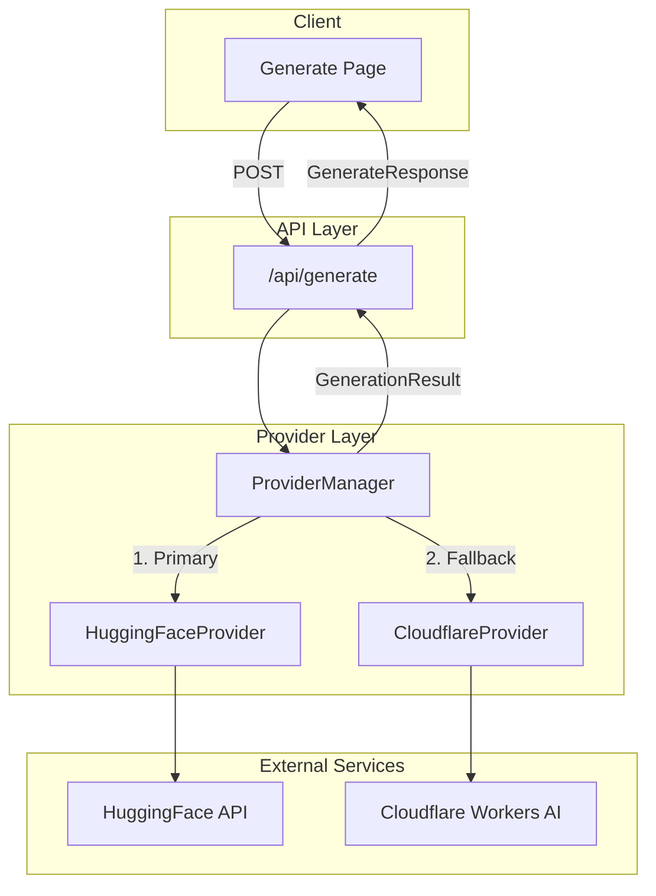

# Design Document: Cloudflare Fallback Provider

## Overview

This design document describes the implementation of a Cloudflare Workers AI provider as a fallback for image generation. The provider will replace the existing Puter provider, which only works client-side, with a server-side compatible solution using Cloudflare's FLUX.1 schnell model.

The implementation follows the existing provider abstraction pattern, implementing the `ImageProvider` interface to ensure seamless integration with the `ProviderManager`. The design prioritizes:

- Drop-in replacement compatibility with existing provider infrastructure
- Consistent error handling and classification
- Secure credential management via environment variables
- Proper response transformation to maintain API contract

## Architecture



### Request Flow

1. User submits generation request from UI
2. API route receives request and calls ProviderManager
3. ProviderManager attempts HuggingFace (primary) first
4. If primary fails with recoverable error, ProviderManager calls Cloudflare (fallback)
5. Response is transformed to GenerationResult and returned to client

## Components and Interfaces

### CloudflareProvider Class

```typescript
/**
 * Cloudflare Workers AI Provider Implementation
 * Implements ImageProvider interface for Cloudflare's FLUX.1 schnell model
 */
export class CloudflareProvider implements ImageProvider {
  readonly name: ProviderName = 'cloudflare';

  /**
   * Generate an image using Cloudflare Workers AI
   * @param prompt - User's prompt for image generation
   * @param options - Generation options including style and timeout
   * @returns ProviderResult with image or error
   */
  async generate(
    prompt: string,
    options: GenerationOptions,
  ): Promise<ProviderResult>;
}
```

### Environment Configuration Functions

```typescript
/**
 * Get Cloudflare Account ID from environment
 * @throws Error if not configured
 */
function getCloudflareAccountId(): string;

/**
 * Get Cloudflare API Token from environment
 * @throws Error if not configured
 */
function getCloudflareApiToken(): string;
```

### Response Transformation Function

```typescript
/**
 * Cloudflare API response structure
 */
interface CloudflareImageResponse {
  success: boolean;
  result?: {
    image?: string; // base64 encoded image
  };
  errors?: Array<{
    code: number;
    message: string;
  }>;
  messages?: string[];
}

/**
 * Transform Cloudflare API response to ProviderResult
 * @param response - Raw Cloudflare API response
 * @returns Transformed ProviderResult
 */
function transformCloudflareResponse(
  response: CloudflareImageResponse,
): ProviderResult;
```

### Updated Type Definitions

```typescript
// Updated ProviderName to include cloudflare
export type ProviderName = 'huggingface' | 'cloudflare';
```

### Factory Function

```typescript
/**
 * Factory function to create CloudflareProvider instance
 */
export function createCloudflareProvider(): CloudflareProvider;
```

## Data Models

### Cloudflare API Request Format

```typescript
interface CloudflareRequest {
  prompt: string;
  // Optional parameters supported by FLUX.1 schnell
  num_steps?: number; // Default: 4 for schnell model
}
```

### Cloudflare API Response Format

```typescript
interface CloudflareImageResponse {
  success: boolean;
  result?: {
    image?: string; // base64 encoded PNG image
  };
  errors?: Array<{
    code: number;
    message: string;
  }>;
  messages?: string[];
}
```

### Environment Variables

| Variable                | Description                           | Required |
| ----------------------- | ------------------------------------- | -------- |
| `CLOUDFLARE_ACCOUNT_ID` | Cloudflare account identifier         | Yes      |
| `CLOUDFLARE_API_TOKEN`  | API token with Workers AI permissions | Yes      |

### API Endpoint

```
POST https://api.cloudflare.com/client/v4/accounts/{account_id}/ai/run/@cf/black-forest-labs/flux-1-schnell
```

### Request Headers

```
Authorization: Bearer {api_token}
Content-Type: application/json
```

## Correctness Properties

_A property is a characteristic or behavior that should hold true across all valid executions of a system—essentially, a formal statement about what the system should do. Properties serve as the bridge between human-readable specifications and machine-verifiable correctness guarantees._

### Property 1: Response Transformation Produces Valid ProviderResult

_For any_ valid Cloudflare API response (success or error), transforming it through `transformCloudflareResponse` SHALL produce a ProviderResult with:

- `success` as a boolean
- `image` as a string (data URL format) when success is true
- `error` as a ProviderError object when success is false

**Validates: Requirements 1.3, 4.1, 4.2, 4.3**

### Property 2: Data URL Format Consistency

_For any_ base64 image string returned by Cloudflare, the transformed output SHALL be a valid data URL matching the pattern `data:image/png;base64,{base64_data}` where `{base64_data}` is the original base64 string.

**Validates: Requirements 4.2**

### Property 3: Fallback Provider Error Invariant

_For any_ error returned by CloudflareProvider, the `shouldFallback` property SHALL always be `false`, since Cloudflare is the fallback provider and there is no further fallback available.

**Validates: Requirements 4.4, 6.4**

### Property 4: 5xx Status Code Classification

_For any_ HTTP status code in the range 500-599, the error classification SHALL return `SERVER_ERROR` as the error code.

**Validates: Requirements 5.3**

### Property 5: Fallback Trigger on Recoverable Errors

_For any_ primary provider failure where `shouldFallback` is `true`, the ProviderManager SHALL attempt generation with the CloudflareProvider using the same prompt and options.

**Validates: Requirements 7.3**

### Property 6: Prompt Style Transformation

_For any_ prompt and style combination, the CloudflareProvider SHALL apply the `buildPrompt` function to transform the prompt before sending to the API, ensuring style-specific suffixes are included.

**Validates: Requirements 3.4**

## Error Handling

### Error Classification Matrix

| HTTP Status   | Error Code          | shouldFallback | Description                     |
| ------------- | ------------------- | -------------- | ------------------------------- |
| 400           | VALIDATION_ERROR    | false          | Invalid request parameters      |
| 401           | UNAUTHORIZED        | false          | Invalid or missing API token    |
| 429           | RATE_LIMIT          | false          | Too many requests               |
| 500           | SERVER_ERROR        | false          | Cloudflare server error         |
| 502           | SERVER_ERROR        | false          | Bad gateway                     |
| 503           | SERVICE_UNAVAILABLE | false          | Service temporarily unavailable |
| Timeout       | TIMEOUT             | false          | Request exceeded timeout        |
| Network Error | SERVER_ERROR        | false          | Network connectivity issue      |

### Error Response Structure

```typescript
{
  success: false,
  error: {
    code: ProviderErrorCode,
    message: string,
    retryAfter?: number,  // Only for RATE_LIMIT errors
    shouldFallback: false // Always false for fallback provider
  }
}
```

### Missing Configuration Handling

When environment variables are missing:

```typescript
{
  success: false,
  error: {
    code: 'SERVER_ERROR',
    message: 'Server configuration error.',
    shouldFallback: false
  }
}
```

## Testing Strategy

### Dual Testing Approach

This feature requires both unit tests and property-based tests for comprehensive coverage:

- **Unit tests**: Verify specific examples, edge cases, and error conditions
- **Property tests**: Verify universal properties across all inputs

### Property-Based Testing Configuration

- **Library**: fast-check (already used in project)
- **Minimum iterations**: 100 per property test
- **Tag format**: `Feature: cloudflare-fallback-provider, Property {number}: {property_text}`

### Unit Test Coverage

1. **CloudflareProvider instantiation**
   - Verify name property is 'cloudflare'
   - Verify generate method exists

2. **Environment variable handling**
   - Missing CLOUDFLARE_ACCOUNT_ID returns SERVER_ERROR
   - Missing CLOUDFLARE_API_TOKEN returns SERVER_ERROR

3. **HTTP error classification**
   - 400 → VALIDATION_ERROR
   - 401 → UNAUTHORIZED
   - 429 → RATE_LIMIT with retryAfter
   - 500 → SERVER_ERROR
   - 503 → SERVICE_UNAVAILABLE

4. **Timeout handling**
   - Request timeout returns TIMEOUT error
   - Custom timeout is respected

5. **Provider Manager integration**
   - Cloudflare is used as fallback
   - HuggingFace remains primary

### Property Test Coverage

1. **Response transformation** (Property 1)
   - Generate random valid Cloudflare responses
   - Verify transformation produces valid ProviderResult

2. **Data URL formatting** (Property 2)
   - Generate random base64 strings
   - Verify output matches data URL pattern

3. **shouldFallback invariant** (Property 3)
   - Generate random error scenarios
   - Verify shouldFallback is always false

4. **5xx classification** (Property 4)
   - Generate random 5xx status codes
   - Verify all classify as SERVER_ERROR

5. **Fallback trigger** (Property 5)
   - Generate random primary failures with shouldFallback=true
   - Verify fallback is attempted

### Test File Structure

```
__tests__/
├── unit/
│   └── cloudflare-provider.test.ts
└── properties/
    └── cloudflare-response-transformation.property.test.ts
```
